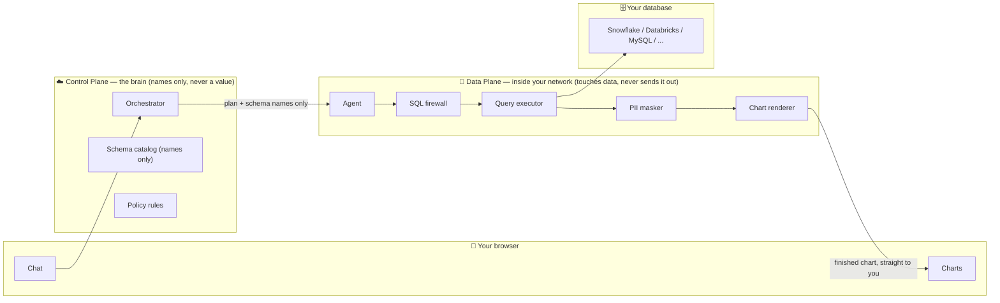
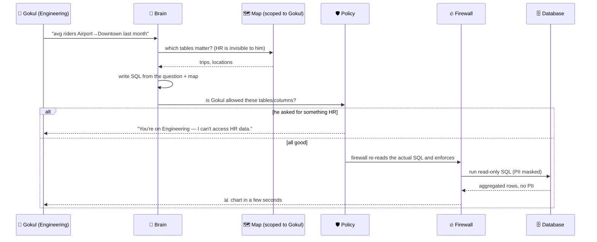
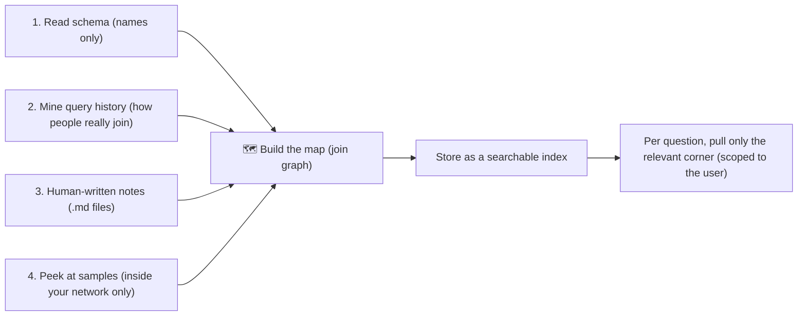

# Atlas — an AI data analyst that actually respects "who's allowed to see what"

You point Atlas at a database, ask a question in plain English, and it hands you back a chart in a few seconds. The interesting part isn't the chart — it's that Atlas refuses to show you data you're not allowed to see, and (in the real deployment story) it does all of this *without the raw data ever leaving your network*.

Everyone can build "chat with your database." The fun, hard part is building it so a security team would actually let it near a real warehouse. That's what I was going for here.

> **Heads up — this repo is a demo/portfolio project.** There's no real login yet: the API trusts whatever `user` you send it. So don't point it at a production warehouse and call it done. The security ideas (the SQL firewall, per-user scoping, the audit trail) are real and tested; the *auth layer* around them is deliberately left as "later." More on that in the [honest limits](#honest-limits) section.

---

## The one-liner

Think of Atlas as a **security-guard librarian** standing at the door of a company's data warehouse.

You ask: *"What's the average number of riders going from Airport to Downtown?"*

The librarian:
1. Figures out what you're actually asking.
2. Knows the building — it has a map of every table and how they connect.
3. Checks your badge — are you even allowed in the HR section? No? Polite refusal.
4. Hides the secrets — phone numbers, salaries, PAN numbers get masked.
5. Fetches only what you're allowed to see, and turns it into a chart.
6. Writes everything down in a logbook — who asked what, what it touched, what it decided.

The golden rule: the librarian never carries books out of the building. Your data stays put; only questions come in and approved answers go out to your own people.

---

## The promise (and the trap hiding inside it)

The promise is simple: **no raw data value ever reaches the vendor.** But almost every feature people *want* quietly breaks that promise if you're not careful:

| What people want | How it secretly leaks data | How Atlas keeps the promise |
|---|---|---|
| An LLM writes the SQL | If a vendor-hosted LLM sees real rows, the data left the building | The LLM only ever sees **table + column names**, never values — or you run your own LLM in your own cloud |
| Charts show up in the chat | If the vendor renders the chart, the rows came to the vendor | Charts get rendered **inside your network**; the finished chart goes straight to your browser |
| The agent "peeks at sample data" | Peeking = reading real values | Peeking only happens **inside your network**, never crosses to the vendor |

So the first real design decision is *where each piece runs*.

---

## The big idea: two planes

Atlas splits into a **Control Plane** (the brain — plans, remembers rules, only ever sees names) and a **Data Plane** (the hands — runs inside your network, touches data, never ships it out).



The brain plans using names only. The hands do all the touching. The finished chart goes from your network straight to your user — it never routes back through the vendor. That last arrow is the whole trust story.

This "bring your own compute" shape is exactly what enterprise security teams already approve. It's more work than piping everything to a hosted LLM — and that extra work *is* the product.

---

## One question, start to finish

**"Average riders from Airport → Downtown last month?"** — asked by Gokul, who's on the Engineering team.



Two kinds of "no" are built in:
- **Wrong team → wrong data:** *"You're on Engineering, I can't show HR data."*
- **PII → masked:** *"I can average this, but I can't show you individual phone numbers."*

One thing worth calling out: **Policy** decides *"is he allowed?"* and the **Firewall** does the actual enforcing — it re-parses the real SQL and blocks/masks before anything runs. Two different jobs, on purpose.

---

## The five things that are genuinely hard

**1. Keeping data out of the vendor's hands.** The agent runs inside your network. The brain only sends schema names and a plan. If an LLM has to see anything, it gets column *stats*, never values — or it's your own LLM. Easy to get right once, easy to regress by accident, so it needs guarding.

**2. "Engineering can't see HR."** The trick most tools miss: hide forbidden tables from the agent's *map*, not just from the *results*. If you only filter results, the agent might say *"table hr.salaries exists but you can't see it"* — which itself leaks that salaries exist. Atlas gives every user a private map, so Gokul's agent literally doesn't know HR is there.

**3. Masking PII.** Find it via existing tags, column-name hints (email, phone, pan, aadhaar), or a sample scan that only ever happens inside your network. Then, where the warehouse supports it, push masking down into the database so raw values never leave the table.

**4. Speed.** A good map means the agent writes SQL in one shot instead of a 20-step loop. Cache repeat questions. Validate the SQL while the chart is being prepped. (Honest note: if the warehouse has to scan billions of cold rows, that's the *database's* time, not something an agent trick can fix.)

**5. Audit.** Every interaction gets logged — user, question, generated SQL, tables/columns touched, every allow/mask/deny and *why*, row counts, timing. It's stored in *your* database, append-only and hash-chained, so tampering shows up.

---

## The "mind map" — how it gets smart about your tables

A dumb agent guesses joins and gets them wrong. Atlas builds a map first, from four sources:



For *"average riders Airport → Downtown,"* the map already knows `trips` has `start_location_id` / `end_location_id`, `locations` maps `id → name`, and how they join (learned from real past queries). So the agent can write this with confidence:

```sql
SELECT AVG(t.rider_count)
FROM trips t
JOIN locations s ON t.start_location_id = s.id
JOIN locations d ON t.end_location_id   = d.id
WHERE s.name = 'Airport' AND d.name = 'Downtown'
  AND t.trip_date >= DATEADD(month, -1, CURRENT_DATE);
```

Those human-written `.md` notes (source #3) are often the difference between "wows in a demo" and "wrong 30% of the time in prod." They live in `docs/semantic/`.

---

## The toolbox

The picks that make this a *governance* product rather than just a chatbot:

- **SQLGlot** — parses and analyzes every query, traces which real tables/columns it touches. This is the firewall's engine.
- **A policy layer** (here: a small dependency-free engine; Cerbos/OpenFGA in a real build) — the "Engineering can't see HR" verdict.
- **A hash-chained audit log** — the tamper-evident logbook, kept in your own database.

Around those: **FastAPI** for the API, **DuckDB** as the local warehouse for the demo, and a plain vanilla-JS frontend so there's no build step to fight with.

---

## What's actually built in this repo

- A synthetic DuckDB warehouse with `rides` and `hr` schemas, plus a `meta.query_history` full of realistic past SQL (so the map has something to learn from).
- A fail-closed **policy engine** (`src/atlas/policy/`).
- The **SQL firewall** (`src/atlas/firewall/firewall.py`) — SELECT-only, allowlist-based, rejects anything it can't fully resolve, and masks PII in output while still letting you count/average it. It has adversarial tests, not just happy-path ones.
- A read-only **catalog** and a query-history-backed **mind map** (`src/atlas/catalog/`), both scoped per user.
- The runtime **analyst** (`src/atlas/agent/`) that ties it together — and only ever runs firewall-approved SQL.
- A hash-chained **audit log** (`src/atlas/audit/`), kept in a separate database from the warehouse.
- A thin **FastAPI** app + a self-contained web UI (`src/atlas/api/`, `static/`).

---

## Running it

```bash
# set up a virtualenv and install deps
python3 -m venv .venv
./.venv/bin/pip install duckdb sqlglot fastapi "uvicorn[standard]" pydantic pytest

# build the demo warehouse
PYTHONPATH=src ./.venv/bin/python -m atlas.data.generate

# run the tests (including the adversarial firewall ones)
PYTHONPATH=src ./.venv/bin/pytest tests/ -q

# try the 5-question demo in the terminal
PYTHONPATH=src ./.venv/bin/python scripts/demo.py

# or spin up the web UI
./.venv/bin/python scripts/serve.py   # then open http://127.0.0.1:8000
```

---

## The 90-second demo (the "wow")

1. Log in as **Priya (HR)** → *"average salary by department"* → clean chart. ✅
2. Log in as **Gokul (Engineering)** → same question → *"You're on Engineering — I can't access HR data."* 🚫
3. As Gokul → *"show me riders' phone numbers"* → *"Phone numbers are masked. Here's the count instead."* 🎭
4. *"avg riders Airport→Downtown"* → chart in a few seconds. 📊
5. Switch to the **Auditor** view → every question, every SQL, every table touched, every block — hash-verified. 📓

---

## Honest limits

I'd rather be upfront than oversell:

- **No auth yet.** The API trusts the `user` field you send it. In a real deployment this sits behind SSO (Keycloak or similar). Until then: demo only.
- **When there's no native DB security, the firewall *is* the security boundary.** On a warehouse like Snowflake you ride on its built-in row/column security. On something like MySQL or Hive, a single parsing gap in the firewall is a data breach — so that's where the real engineering rigor goes, and why it's the one component with adversarial tests.
- **The audit log is tamper-*evident*, not tamper-*proof*.** The hash chain makes edits/deletions detectable, but someone with full DB access could recompute the whole chain. A real build would use an immutable store (immudb, QLDB).
- **Sub-5-second answers aren't guaranteed on cold, huge scans** — that time belongs to the database, not to Atlas.
- **The novel part is the governance shell, not text-to-SQL itself.** Tools like WrenAI, Vanna, and Dataherald already do the text-to-SQL well. What I care about here is the *governance* around it: per-user map scoping, the firewall, and the audit trail.

---

*This started as a "what would it take to make an AI analyst a security team would actually approve" thought experiment. The map came before the journey, and I tried to stay honest about where the map is still fuzzy.*
