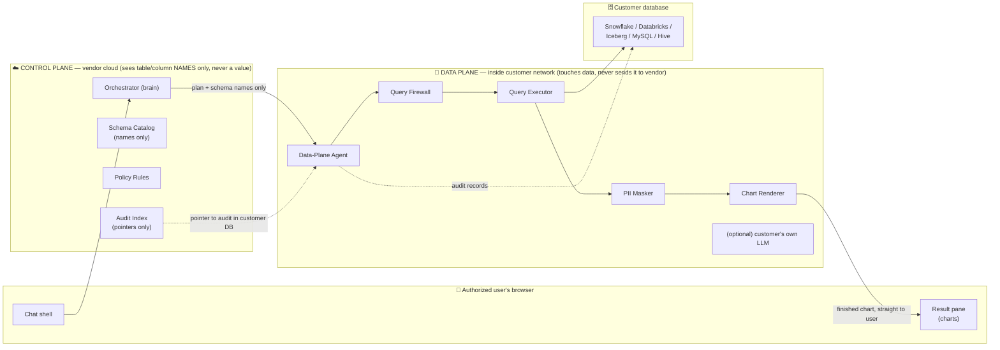
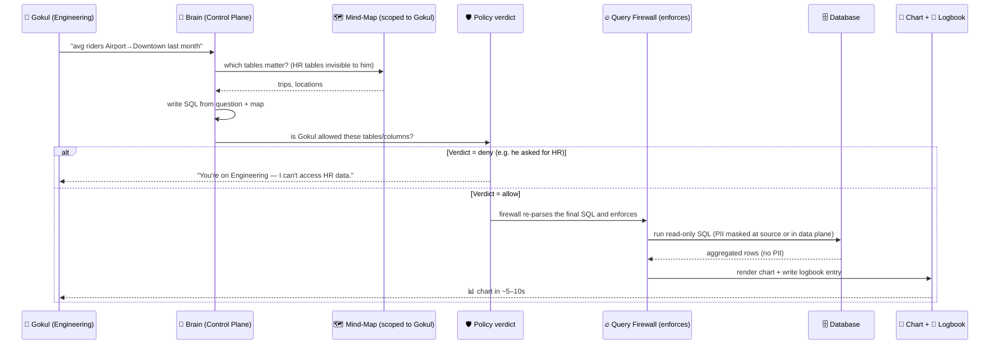
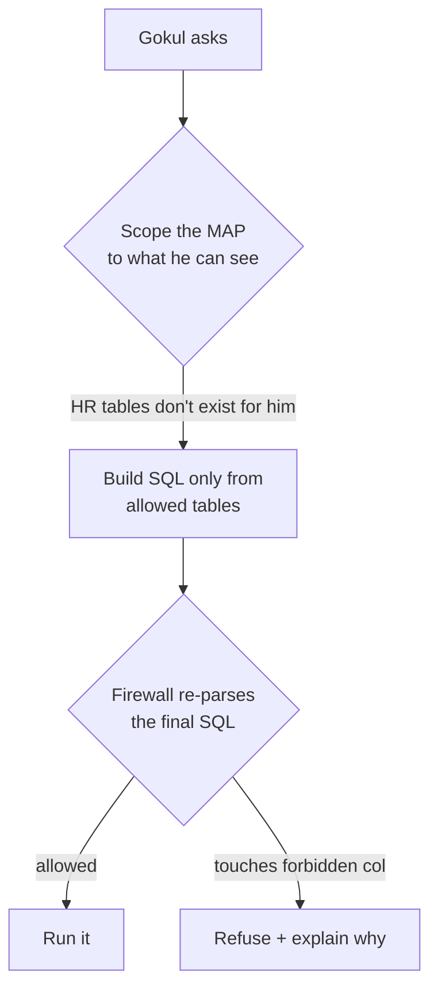
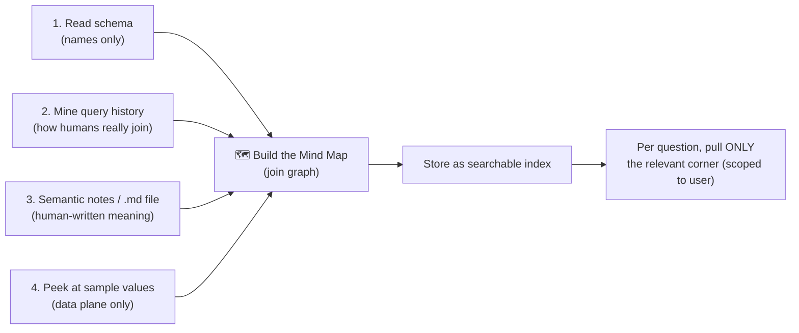

# Hero Project — A Governed AI Data Analyst

*A plug-and-play AI agent that sits on top of any company's database, answers questions in plain English with charts, and enforces "who is allowed to see what" — while **no data ever reaches us, the vendor**.*

---

## 0. Read this first (the honest 60-second version)

**What it is:** an AI analyst you point at your warehouse. You ask in English, it returns a chart in seconds, and it refuses to show data you're not allowed to see.

**The one real promise — stated precisely:** *No data value ever reaches the vendor's cloud.* The AI's "brain" (planning, rules, the schema map) runs in our cloud and only ever sees **table and column names, never values**. All touching of real data happens inside **your** network, and the finished answer goes straight from your network to your authorized user's browser.

**What that promise does *not* mean:** it does **not** mean "nobody sees the answer." The authorized user of course sees their own approved chart — that's the point. "No data leaves" means *to us, the vendor*, not *to the person who asked*.

> ⚠️ **Honest limit up front:** the two hardest things here are (1) making that no-vendor-egress split real, and (2) *statically proving a generated SQL query is safe before it runs*. Where a warehouse has no built-in security (MySQL, Hive), **we become the security boundary** — and a bug there is a data breach. That risk gets its own section (§9), not a footnote.

Everyone can build "chat with your database." The hard, valuable part is building it so **Uber/Rapido's security team would actually let it in.** That's this project.

---

## 1. The pitch in plain English

> Think of it as a **smart, security-guard librarian** standing at the door of a company's data warehouse.

You ask: *"What's the average number of riders travelling from Airport to Downtown?"*

The librarian:
1. **Understands** your question.
2. **Knows the building** — has a map of every shelf (table) and how they connect.
3. **Checks your badge** — are you even allowed in the HR section? No? Polite refusal.
4. **Hides the secrets** — covers up phone numbers, salaries, Aadhaar/PAN.
5. **Fetches only what you may see**, turns it into a **chart** in the same chat.
6. **Writes everything in a logbook** — who asked what, what it touched, what it answered.

Golden rule: **the librarian never carries books out to the vendor.** The books (data) stay in your building; only instructions come in and approved answers go to your own people.

---

## 2. The promise, and the trap inside it

Our promise: **no data value reaches the vendor.** Three things people want all *break* that promise if you're careless:

| Feature they want | Why it secretly leaks data to the vendor | How we keep the promise |
|---|---|---|
| An LLM writes the SQL | If a **vendor-hosted** LLM sees real rows, data left | Send the LLM **schema + column stats only, never values** — or run the LLM **inside the customer's tenant** (their Bedrock/Vertex/Azure) |
| Charts show up in the chat | If the **vendor's cloud** renders the chart, the rows came to the vendor | **Render inside the data plane**; the user's browser fetches the finished chart *directly from the customer's network*, not from us |
| The agent "peeks at sample data" | Peeking = reading real values | Peeking happens **only inside the data plane**; samples never cross to the vendor |

So the very first design decision is *where each piece runs*. That's §3.

> **Assumption (mark, §5):** the chat UI is a thin shell served by the vendor, but the **result pane streams from the data plane** (customer network) so answer values never transit the vendor. *If wrong* (i.e. if we let the vendor render results), the "no vendor egress" promise collapses to "no raw PII egress" — a much weaker, though still sellable, claim.

---

## 3. The big idea: two "planes"

We split the product into a **Control Plane** (vendor cloud — the *brain*, sees only names) and a **Data Plane** (a container running *inside the customer's network* — the *hands*, touches data, never ships it to the vendor).



**How to read it:** the brain (vendor cloud) plans and remembers rules using **names only**. The hands (customer network) do all touching. The finished chart goes **from the customer's network straight to the customer's user** — it never routes through the vendor. That diagonal `RENDER → PANE` line is the whole trust story: it does **not** pass through the vendor cloud.

> **Why this shape (Certain — it's the standard enterprise trust model):** "bring-your-own-compute" is exactly what security teams approve. It's more work than piping everything to OpenAI, and that extra work *is* the product.

---

## 4. One question, end to end

Question: **"Average riders from Airport → Downtown last month?"** asked by **Gokul (Engineering)**.



Two refusals are built in:
- **Wrong team → wrong data:** "You're on Engineering, I can't show HR data."
- **PII → masked:** "I can average this, but I can't show individual phone numbers (masked)."

Note the split, which the previous draft blurred: **Policy = the *verdict* ("is he allowed?"). Firewall = the *enforcement* (parse the actual SQL, block/rewrite/mask before it runs).** Two different jobs, two different tools.

---

## 5. The five hard challenges — how we beat each (and what stays hard)

### A — "No data reaches the vendor"
**Solve:** the Data-Plane Agent runs inside the customer network. The brain only sends **schema names** and **plans**. If an LLM must see anything, either it gets **column stats, never values**, or it's the **customer's own LLM** in their tenant. Charts render in the data plane and go straight to the user.
**Stays hard:** the LLM and the render pane are both potential leak points; you must consciously keep both inside the perimeter. Easy to regress by accident.

### B — "Engineering can't see HR" (access control)
**Solve — two layers so we never leak even a hint:**



The senior trick: **hide forbidden tables from the agent's *map*, not just from the *results*.** If we only filtered results, the agent could say *"table hr.salaries exists but you can't see it"* — which itself leaks that salaries exist. Scoping the **map** means Gokul's agent literally doesn't know HR exists. **Every user gets a private map.**
**Prefer the database's own security** (Snowflake roles, Databricks Unity Catalog) by connecting *as the user*. Only where the DB has none (MySQL, Hive) do we enforce it ourselves — see §9, because that's where the real risk lives.

### C — PII must be masked
**Solve:** find PII three ways — (1) trust the customer's existing tags first, (2) column-name hints (email, phone, pan, aadhaar), (3) a sample-value scan *inside the data plane only*.
**Two enforcement paths, be honest about which:**
- **Warehouses with native masking** (Snowflake, Databricks, BigQuery): push masking **down into the DB** — raw values never leave the table. ✅ strongest.
- **No native masking** (MySQL, Hive, raw Iceberg): the data-plane agent reads the raw value and masks it *before* rendering. Raw PII enters the agent process — **still inside the customer perimeter**, so the no-vendor-egress promise holds, but say so plainly.

The agent then explains itself: *"I can average this column; individual values are masked."*

### D — Speed (5–10s)
**Solve:**
- **Don't let the AI ramble.** A good map + retrieval = SQL in *one shot*, not a 20-step loop.
- **Remember past answers (semantic cache):** the 5th person asking "avg trips A→B" gets the same answer instantly — faster *and* consistent.
- **Parallelize:** validate SQL *while* prepping the chart.
- **Small model for easy steps, big model only for hard ones.**

> ⚠️ **Honest limit (§5):** if the warehouse is cold and scans billions of rows, that time is the *database's*, not ours — no agent trick fixes it. Sell **"time-to-first-insight"** (our overhead + a fast preview), then the full result. Do **not** promise sub-5s on arbitrary cold scans; that's a claim we can't keep.

### E — Audit ("who fired what?")
**Solve:** record per interaction — user, question, generated SQL, tables/columns touched, **every allow/mask/deny decision + reason**, row counts, timing, model cost. Store it **in the customer's own database**, append-only and **hash-chained** (tamper-evident). The vendor keeps only a pointer. The audit team gets their own screen: *"everything the agent touched in HR last week."*

---

## 6. The "mind map" — how the agent gets smart about the tables

This is the accuracy engine. A dumb agent guesses joins and gets them wrong. Ours builds a map first.



**Example.** For *"average riders Airport → Downtown,"* the map knows: `trips` has `start_location_id`, `end_location_id`, `rider_count`; `locations` maps `id → name`; the join `trips.start_location_id = locations.id` (learned from real past queries). So the agent writes confidently:

```sql
SELECT AVG(t.rider_count)
FROM trips t
JOIN locations s ON t.start_location_id = s.id
JOIN locations d ON t.end_location_id   = d.id
WHERE s.name = 'Airport' AND d.name = 'Downtown'
  AND t.trip_date >= DATEADD(month, -1, CURRENT_DATE);
```

The **".md file"** you asked about is item #3 — a human-approved note per table:

```markdown
## table: trips
One row per completed ride. Grain = 1 ride.
- rider_count: passengers in the ride (NOT number of trips)
- start_location_id / end_location_id → join to locations.id
- ⚠️ do NOT use `trips_old`, it's deprecated
```

That single file is often the difference between "wows in a demo" and "wrong 30% of the time in prod."

---

## 7. The toolbox — open-source, light, secure, fast (with popular alternatives)

For each job: our pick, why, and the heavyweight alternative so you know the trade-off.

| Job | 🟢 Our pick | Why | 🔵 Popular alternative |
|---|---|---|---|
| **Parse + analyze SQL, and column lineage** (the firewall's core) | **SQLGlot** | Tiny, no server, 20+ dialects, finds every table/column a query touches — **and has built-in lineage** (`sqlglot.lineage`), so no second tool | Apache Calcite (powerful, heavy, JVM) |
| **Text → SQL brains** | **Custom** (retrieval over the map) | Full control, model-agnostic | **WrenAI**, **Vanna.ai**, **Dataherald** (OSS, close to this — study them; see §8) |
| **Agent orchestration** | **LangGraph** or **Pydantic AI** | Explicit, debuggable, light | LlamaIndex, Haystack |
| **The LLM** | **Claude (Opus 4.8 / Sonnet 5)** or **bring-your-own** | Strong SQL + reasoning; BYO keeps data in-tenant | GPT-5.x; self-hosted Llama for max privacy |
| **Search the map (vectors)** | **LanceDB** | Embedded, no server, fast, file-based | Qdrant, Weaviate, pgvector |
| **Policy *verdict* (who may see what)** | **Cerbos** or **OpenFGA** | Purpose-built app authorization, fast, simple rules — decides *yes/no*, does **not** rewrite SQL | Open Policy Agent (OPA/Rego) |
| **Policy *enforcement* (rewrite/block/mask SQL)** | **SQLGlot** + the **DB's native masking/row-access** | Enforcement must happen on the actual query + at source | hand-rolled rewriters (don't) |
| **Login / SSO** | **Keycloak** | OSS OIDC + SAML, battle-tested | Authentik, Ory, Auth0 (SaaS) |
| **Find & mask PII** | **Microsoft Presidio** | OSS PII detection + anonymization | Google Cloud DLP (SaaS) |
| **Talk to many databases** | **SQLAlchemy / ADBC** (or **Ibis**) | Direct SQL execution + introspection across engines | Trino/Starburst (true federation, heavy) |
| **Local Iceberg for the demo** | **DuckDB + MinIO** | You already know these; light, fast | Spark + S3 |
| **Semantic layer (metric defs)** | **Cube** | OSS headless BI / metric definitions | dbt MetricFlow, LookML |
| **Charts from a spec** | **Vega-Lite** or **ECharts** | LLM emits JSON, browser draws it | Plotly, Recharts |
| **Tamper-proof audit log** | **immudb** or Postgres + hash-chain | Immutable, cryptographically verifiable | AWS QLDB |
| **See where time/tokens go** | **Langfuse** + **OpenTelemetry** | OSS LLM tracing, self-hostable | Arize Phoenix, Helicone |
| **Semantic cache (speed)** | **GPTCache** or Redis-vector | Skip the LLM for repeat questions | Redis Enterprise |
| **Backend / API** | **FastAPI** | Light, fast, async | — |
| **Frontend** | **Next.js** | You already use it | — |
| **Package the data-plane box** | **Docker** | Runs in any customer network | — |

> **The three tools that make this a *governance* product, not a chatbot:** **SQLGlot** (reads + enforces on every query), **Cerbos/OpenFGA** (the "Engineering can't see HR" verdict), **immudb** (the tamper-proof logbook).

---

## 8. How we differ from WrenAI / Vanna / Dataherald (be honest)

Those OSS tools already do text-to-SQL + *some* governance. If we don't say what's different, this looks like a clone. Our narrow, defensible wedge is exactly three things:

1. **No-vendor-egress architecture** (they mostly assume a hosted setup).
2. **Per-user *catalog* scoping** — the agent can't see, name, or hint at tables you're not allowed to (most tools scope results, not the map).
3. **Tamper-evident audit stored in the customer's own DB.**

*Everything else (the text-to-SQL, the charts) is table stakes we reuse, not invent.* For a portfolio piece that's the right honest framing — the value is the governance shell, not reinventing text-to-SQL.

---

## 9. The risk that gets its own section: we become the security boundary

This is the load-bearing engineering risk, so it does **not** get buried in a table.

- Where the warehouse governs itself (Snowflake, Databricks), we ride on its security — low risk.
- Where it **doesn't** (MySQL, Hive, raw Iceberg), **our SQL firewall is the only thing standing between a user and forbidden data.** A single parsing gap = a breach: `SELECT *` expansion, nested CTEs, subqueries, dynamic SQL, clever aliasing, or a dialect quirk SQLGlot resolves wrong.
- **Rules that make this survivable:**
  - **Fail closed:** any query we cannot fully resolve to concrete tables/columns is **rejected**, not run.
  - **Read-only enforced two ways:** a read-only DB role *and* a parse-level DML/DDL block.
  - **Allowlist, not blocklist:** enforce against "the tables this user may touch," never "the tables they may not."
  - **Enforce before execution**, never filter results after.
  - **The firewall is the one component that gets adversarial tests**, not just happy-path demos.

> This is also the honest ceiling on the whole product: **it is only as trustworthy as the SQL firewall.** That's where the real engineering rigor goes.

---

## 10. What we build first (portfolio) vs later

✅ **Build now — the defensible core:**
- Control/data-plane split (both in local Docker is fine for the demo)
- The **mind-map** context engine (schema + query-history + one .md notes file)
- The **per-user private map** (Gokul can't see HR exists)
- The **SQLGlot query firewall**, fail-closed, with **adversarial tests**
- **Self-explaining refusals** ("Engineering, can't see HR" / "this is masked")
- The **tamper-proof audit console**
- **One** synthetic dataset (reuse your transaction generator; DuckDB/Iceberg locally)

🕒 **Later chapters — document, don't build:**
- Real SSO (Keycloak), multiple live warehouses, cross-database federation, bring-your-own-LLM, cost guardrails at scale

---

## 11. The 90-second demo (the "wow")

1. Log in as **Priya (HR)** → *"average salary by department"* → clean chart. ✅
2. Log in as **Gokul (Engineering)** → **same** question → *"You're on Engineering — I can't access HR data."* 🚫
3. As Gokul → *"show me riders' phone numbers"* → *"Phone numbers are masked. Here's the count instead."* 🎭
4. *"avg riders Airport→Downtown"* → chart in ~6s. 📊
5. Switch to **Auditor** view → *"every question, every SQL, every table touched, every block — hash-verified."* 📓

---

## Assumptions & honest limits (read before acting)

- **Assumption:** the result pane streams from the data plane, not the vendor. *If wrong,* "no vendor egress" weakens to "no raw-PII egress."
- **Assumption:** customers accept deploying a container inside their network. *If wrong,* the whole trust model changes and this becomes a hosted tool with a weaker promise.
- **Honest limit:** sub-5s is not guaranteed on cold/large warehouse scans — that time is the DB's. We promise fast *time-to-first-insight*, not fast arbitrary queries.
- **Honest limit:** for non-governed sources we are the security boundary (§9); the product is only as safe as the SQL firewall.
- **Honest limit:** the novel part is the governance shell (§8), not text-to-SQL itself. Framed that way on purpose.
- **What would change this design:** if target customers *all* run governed warehouses (Snowflake/Databricks), drop the DIY-enforcement path entirely and lean 100% on native security — simpler and safer. If any target runs MySQL/Hive, §9 is unavoidable.

---

*Design/brainstorm document — nothing is built yet. This is the map before the journey, written to be honest about where the map is uncertain.*
